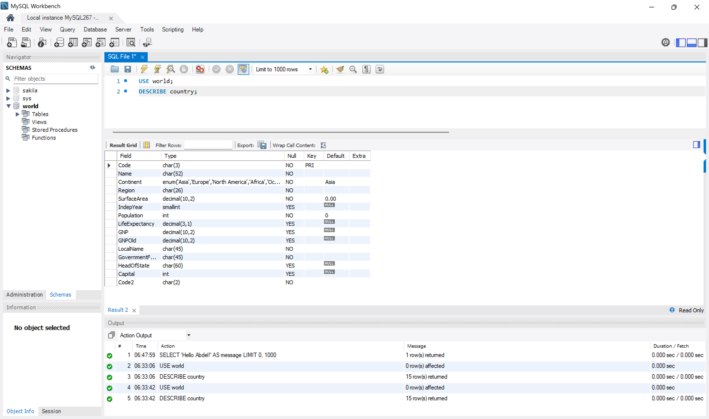
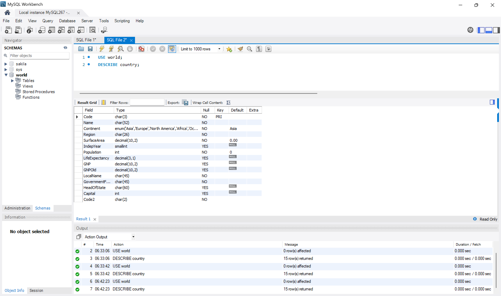
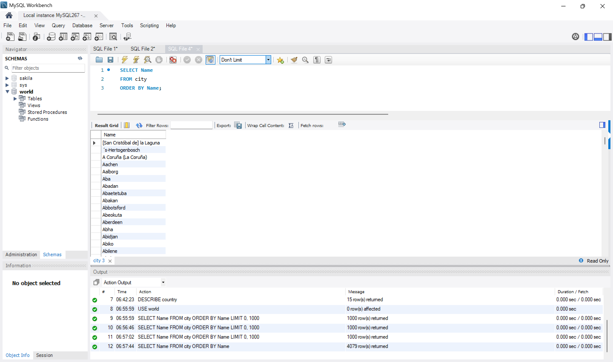
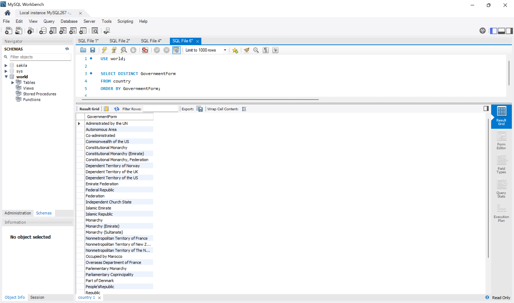
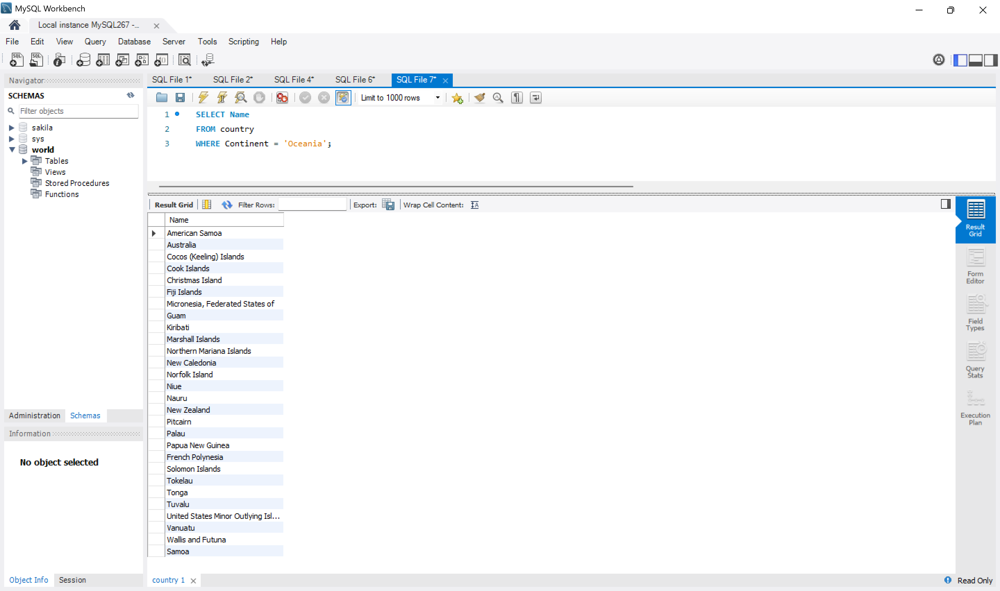
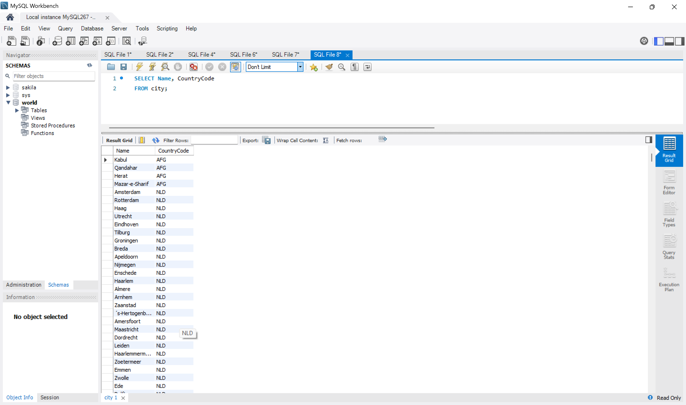
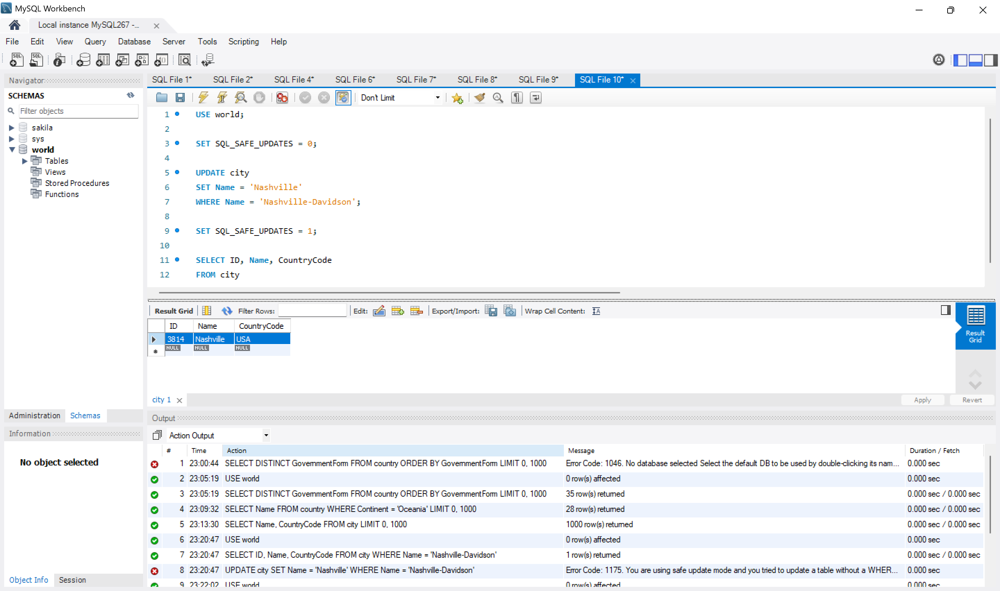
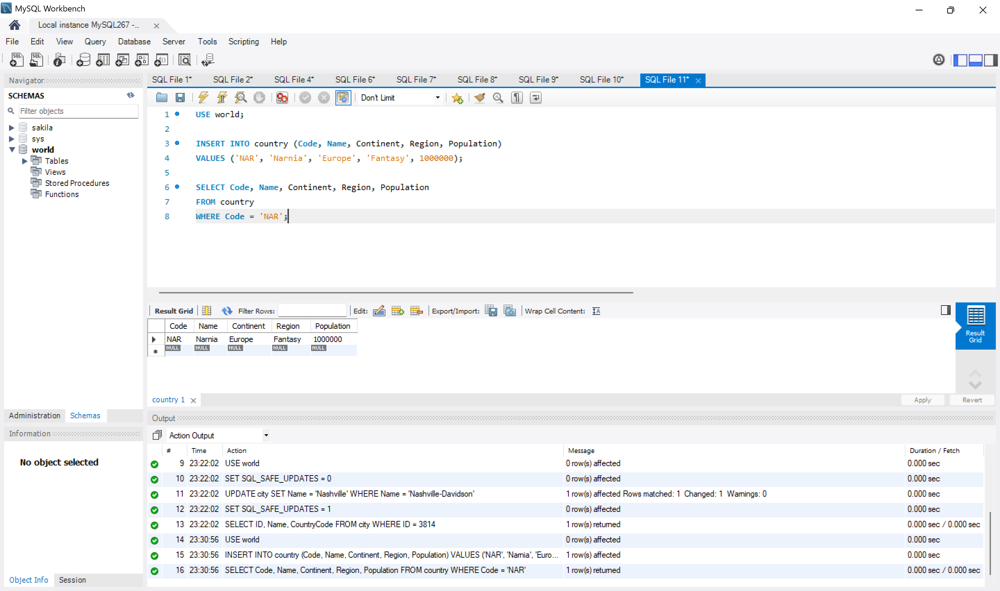
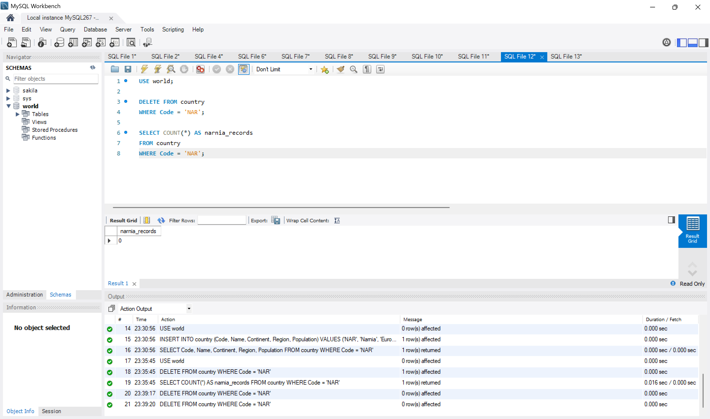

# Exercise 01: World Database SQL Practice

- Name: Abdelhafidh Mahouel
- Course: Database for Analytics
- Module: 1
- Database Used: World Database

---

See:

[MySQL: Setting Up the World Database](https://dev.mysql.com/doc/world-setup/en/)

---

## Instructions

- Answer each question below.
- All SQL commands **must be executed** against the World database.
- For each SQL command:
  - Include the SQL in a fenced code block
  - Include a **screenshot** showing the command and results
- Store screenshots in the `screenshots/` folder and embed them below each answer.

---

## Question 1

**Compare and contrast the data types used for:**

- `country.Population`
- `country.LifeExpectancy`

Why were these data types selected?

### Answer

`country.Population` uses the `INT` data type, while
`country.LifeExpectancy` uses the `DECIMAL(3,1)` data type.

`Population` uses `INT` because it represents a count of people, which
is normally recorded as a whole number. In comparison, `LifeExpectancy`
uses `DECIMAL(3,1)` because it represents an estimated number of years
that may include a fractional value. The `DECIMAL(3,1)` type supports
three total digits with one digit after the decimal point, such as
`72.5`.

### Screenshot

```sql
USE world;
DESCRIBE country;
```



---

## Question 2

**What is the data type of `country.IndepYear`?**
Why do you think this data type was selected?

### Answer

The data type of `country.IndepYear` is `SMALLINT`.

This data type was likely selected because an independence year is
stored as a whole number without a decimal value. `SMALLINT` requires
less storage than a regular `INT` while still providing a sufficient
range for historical years. The column also permits `NULL` values
because some countries or territories may not have an applicable or
known independence year.

### Screenshot

```sql
DESCRIBE country;
```



---

## Question 3

**Make a case for a different data type for `country.IndepYear`.**
Explain why your proposed data type might be better in some situations.

### Answer

The `YEAR` data type could be used instead of `SMALLINT` when the
database contains only modern independence years. `YEAR` would make the
purpose of the column clearer because it is specifically designed to
store year values. It could also provide better validation by limiting
the column to valid years instead of allowing unrelated integer values.

However, MySQL's `YEAR` data type has a limited supported range.
Therefore, it may not be suitable for ancient or BCE independence
years. In those situations, the existing `SMALLINT` data type would
remain more flexible.

---

## Question 4

Write a SQL command to **list the names of all cities in alphabetical order**.

### SQL

```sql
SELECT Name
FROM city
ORDER BY Name;
```

### Screenshot



---

## Question 5

Write a SQL command to
**list all forms of government from the `country` table**,
showing **each only once**, sorted alphabetically.

### SQL

```sql
SELECT DISTINCT GovernmentForm
FROM country
ORDER BY GovernmentForm;
```

### Screenshot



---

## Question 6

Write a SQL command to **list all countries in the `Oceania` continent**.

### SQL

```sql
SELECT Name
FROM country
WHERE Continent = 'Oceania';
```

### Screenshot



---

## Question 7

Write a SQL command to **list the names and country code of all cities**.

### SQL

```sql
SELECT Name, CountryCode
FROM city;
```

### Screenshot



---

## Question 8

Write a SQL command to **update the city named `"Nashville-Davidson"` to `"Nashville"`**.

### SQL

```sql
USE world;

SET SQL_SAFE_UPDATES = 0;

UPDATE city
SET Name = 'Nashville'
WHERE Name = 'Nashville-Davidson';

SET SQL_SAFE_UPDATES = 1;

SELECT ID, Name, CountryCode
FROM city
WHERE ID = 3814;
```

### Screenshot



---

## Question 9

Write a SQL command to **insert a new country named `"Narnia"`**
with a country code of `"NAR"`.
Use reasonable values for the remaining columns.

### SQL

```sql
USE world;

INSERT INTO country (Code, Name, Continent, Region, Population)
VALUES ('NAR', 'Narnia', 'Europe', 'Fantasy', 1000000);

SELECT Code, Name, Continent, Region, Population
FROM country
WHERE Code = 'NAR';
```

### Screenshot



---

## Question 10

Write a SQL command to **delete the country with the country code `"NAR"`**.

### SQL

```sql
DELETE FROM country
WHERE Code = 'NAR';

SELECT COUNT(*) AS narnia_records
FROM country
WHERE Code = 'NAR';
```

**Note:** The `DELETE` statement removes the country with the code
`NAR`. The second statement is only used to verify the deletion. The
result of `0` confirms that no record with the code `NAR` remains.

### Screenshot


