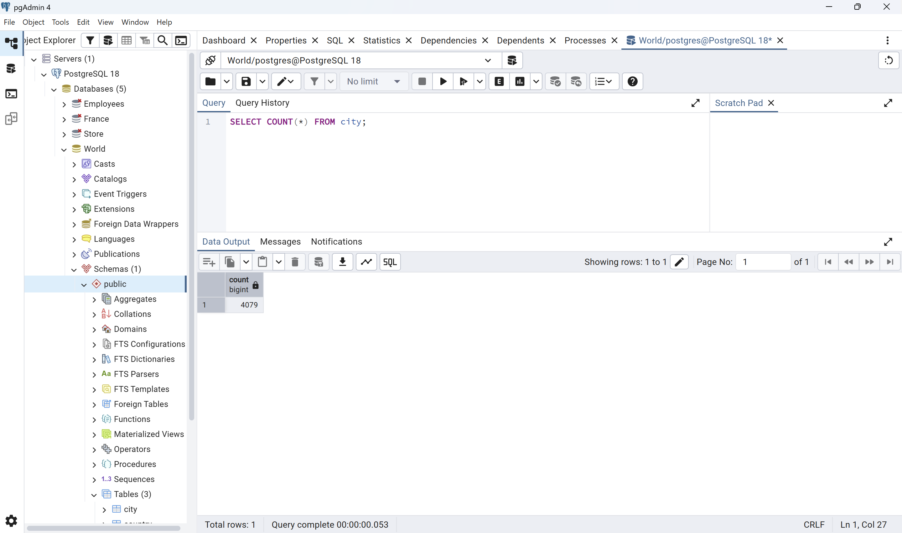
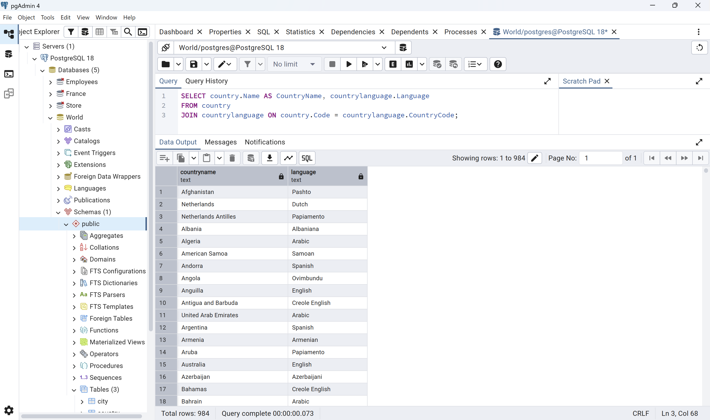
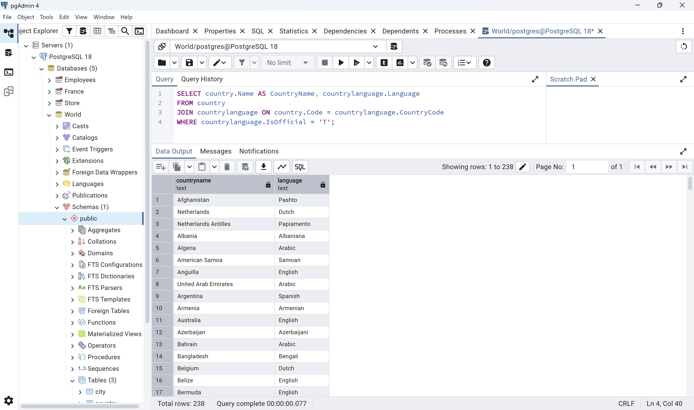
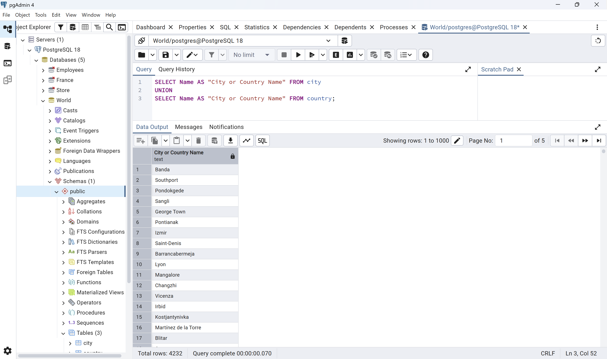
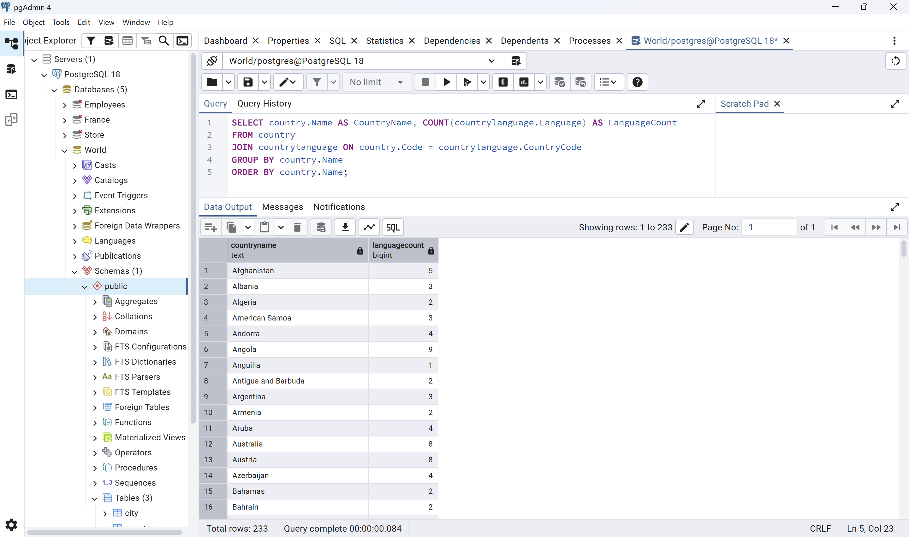
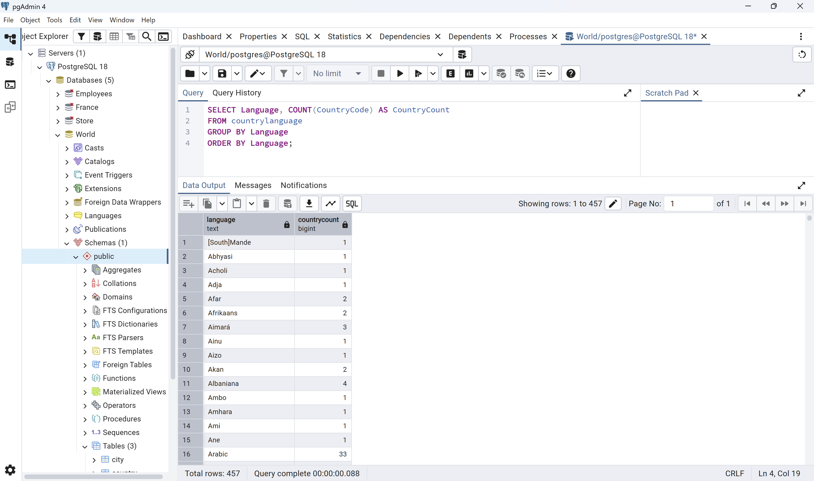
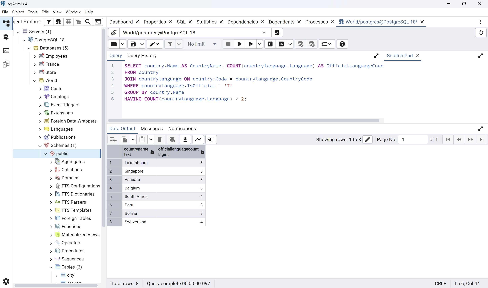
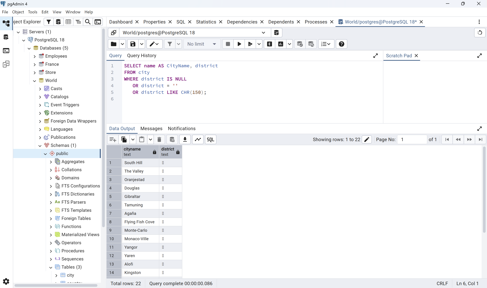
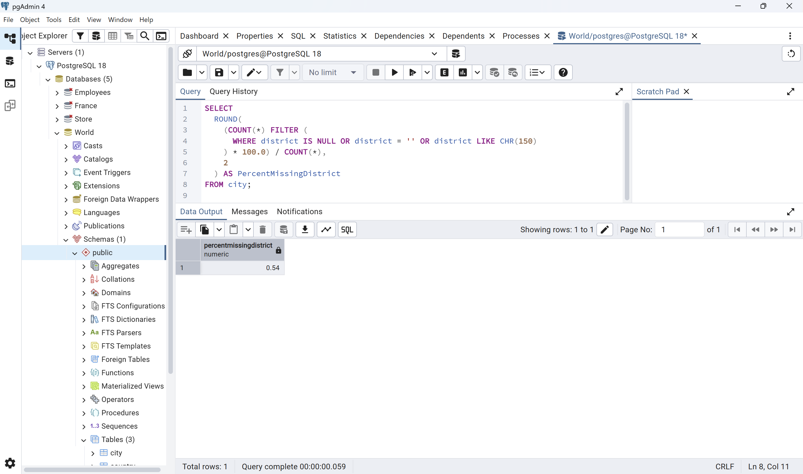

# Exercise 02: World Database – Joins, Grouping, and Data Quality

- Name:
- Course: Database for Analytics
- Module: 2
- Database Used: World Database (PostgreSQL)

---

## Instructions

- Answer each question below using SQL executed against the **World database**.
- All SQL commands **must be run by you**.
- For each SQL-based question:
  - Include the SQL command in a fenced code block
  - Include a **screenshot** showing the command and its results
- Store screenshots in the `screenshots/` folder and embed them below each answer.

---

## Question 1

When importing records from `worldPGSQL.sql`, **how many cities were imported**?

### Answer

4079 cities were imported.

### Screenshot

Verified using a COUNT query on the city table.

```sql
SELECT COUNT(*) FROM city;
```



---

## Question 2

Using the World database, write the SQL command to
**display each country name**
along with the **name of each language spoken in that country**.

### SQL

```sql
SELECT country.Name AS CountryName, countrylanguage.Language
FROM country
JOIN countrylanguage ON country.Code = countrylanguage.CountryCode;
```

### Screenshot


---

## Question 3

Using the World database, write the SQL command
to **display each country name** along with the name
of each **official language spoken in that country**.

### SQL

```sql
SELECT country.Name AS CountryName, countrylanguage.Language
FROM country
JOIN countrylanguage ON country.Code = countrylanguage.CountryCode
WHERE countrylanguage.IsOfficial = 'T';
```

### Screenshot



---

## Question 4

Consider the following two SQL statements:

```sql
SELECT *
FROM country, countrylanguage
WHERE country.code = countrylanguage.countrycode;
```

```sql
SELECT *
FROM country
LEFT OUTER JOIN countrylanguage
ON country.code = countrylanguage.countrycode;
```

### Answer

The first query, using an implicit inner join, returned 984 rows. The second query, using a LEFT OUTER JOIN, returned 990 rows. The extra 6 rows in the second query represent countries that exist in the country table but have no matching row in the countrylanguage table. Because a LEFT OUTER JOIN keeps every row from the left table (country) even when there is no match on the right (countrylanguage), those countries still appear in the results, just with NULL values in the language-related columns. The first query silently excludes any country without a matching language record, which is why it returns fewer rows.

---

## Question 5

Using the World database, write the SQL command
to **list all different forms of government** found in the data.
Do **not** repeat any form of government more than once.

### SQL

```sql
SELECT DISTINCT GovernmentForm FROM country;
```

## Question 6

Using the World database, write the SQL command
to **list all names of cities and countries in one column**.
Label the column **"City or Country Name"**.

### SQL

```sql
SELECT Name AS "City or Country Name" FROM city
UNION
SELECT Name AS "City or Country Name" FROM country;
```

### Screenshot



---

## Question 7

Using the World database, write the SQL command
to **list all countries by name**,
along with the **number of languages spoken in each country**.
Be sure to **sort by country name**.

### SQL

```sql
SELECT country.Name AS CountryName, COUNT(countrylanguage.Language) AS LanguageCount
FROM country
JOIN countrylanguage ON country.Code = countrylanguage.CountryCode
GROUP BY country.Name
ORDER BY country.Name;
```

### Screenshot



---

## Question 8

Using the World database, write the SQL command
to **list all languages**, along with the
**number of countries where each language is spoken**.
Be sure to **sort by language name**.

### SQL

```sql
SELECT Language, COUNT(CountryCode) AS CountryCount
FROM countrylanguage
GROUP BY Language
ORDER BY Language;
```

### Screenshot



---

## Question 9

Using the World database, write the SQL command
to **list countries that have more than two official languages**,
along with the **number of official languages spoken**.

_Hint: There are 8 such countries in this dataset._

### SQL

```sql
SELECT country.Name AS CountryName, COUNT(countrylanguage.Language) AS OfficialLanguageCount
FROM country
JOIN countrylanguage ON country.Code = countrylanguage.CountryCode
WHERE countrylanguage.IsOfficial = 'T'
GROUP BY country.Name
HAVING COUNT(countrylanguage.Language) > 2;
```

### Screenshot



---

## Question 10

Using the World database, write the SQL command to
**find cities where the district value is missing**.

Hint: Use `LIKE` and the dash (`-`)
since some rows use that instead of actual data.

### SQL

```sql
SELECT name AS CityName, district
FROM city
WHERE district IS NULL
   OR district = ''
   OR district LIKE CHR(150);
```


Note: The hint suggests using a plain dash (`-`), but a direct ASCII check on this
dataset (using the ASCII() function) showed that the placeholder character actually
stored in the district column has character code 150, not the standard hyphen
(code 45). This character is visually similar to a dash but is technically different,
which is why a literal `-` or copy-pasted dash character did not match any rows.
Using CHR(150) reliably matches the exact character stored in the data, regardless
of how it displays on screen. This query also includes rows where district is NULL
or an empty string (''), since both represent missing data along with the dash
placeholder.

### Screenshot



---

## Question 11

Using the World database, write the SQL command to
**calculate the percentage of cities with missing district values**.

_Hint: The result should be approximately 0.4%._

### SQL

```sql
SELECT
  ROUND(
    (COUNT(*) FILTER (
      WHERE district IS NULL OR district = '' OR district LIKE CHR(150)
    ) * 100.0) / COUNT(*),
    2
  ) AS PercentMissingDistrict
FROM city;
```


Note: Including NULL values, empty strings, and the CHR(150) placeholder together
results in 22 missing rows out of 4079 total cities, or approximately 0.54%. This is
slightly higher than the exercise's hint of ~0.4%, which appears to reflect only the
CHR(150) placeholder rows (18 rows, ~0.44%) without the additional empty-string rows.
Both empty strings and the placeholder character represent missing data, so this
broader definition was used here for completeness, even though it does not match
the hint exactly.

### Screenshot


