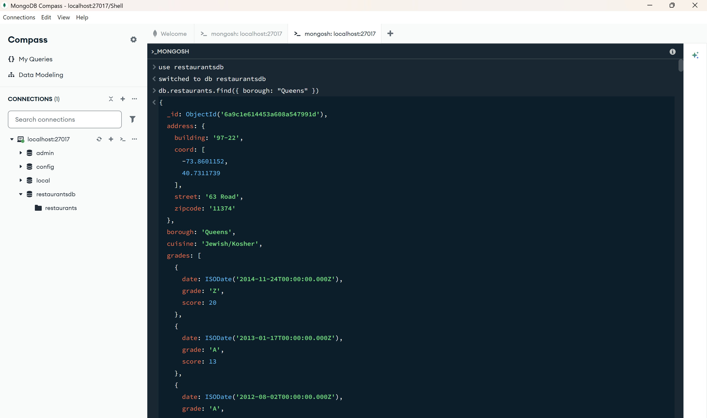
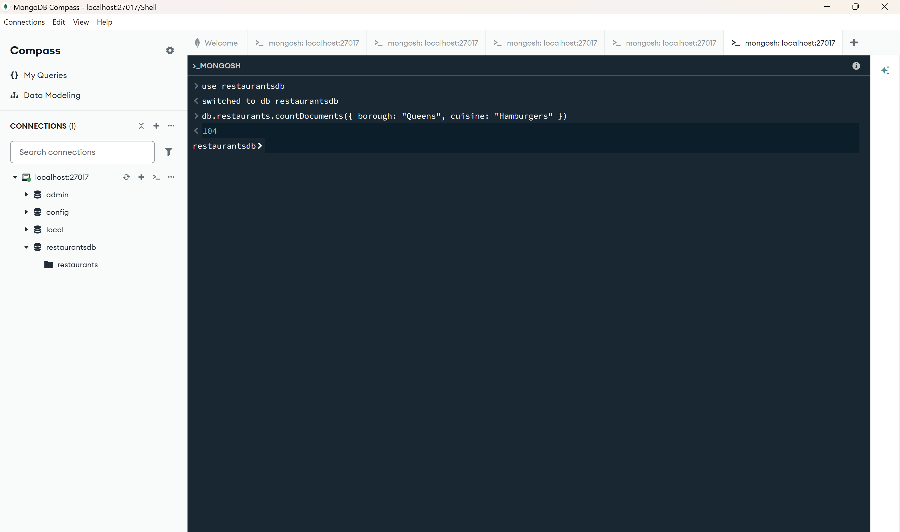
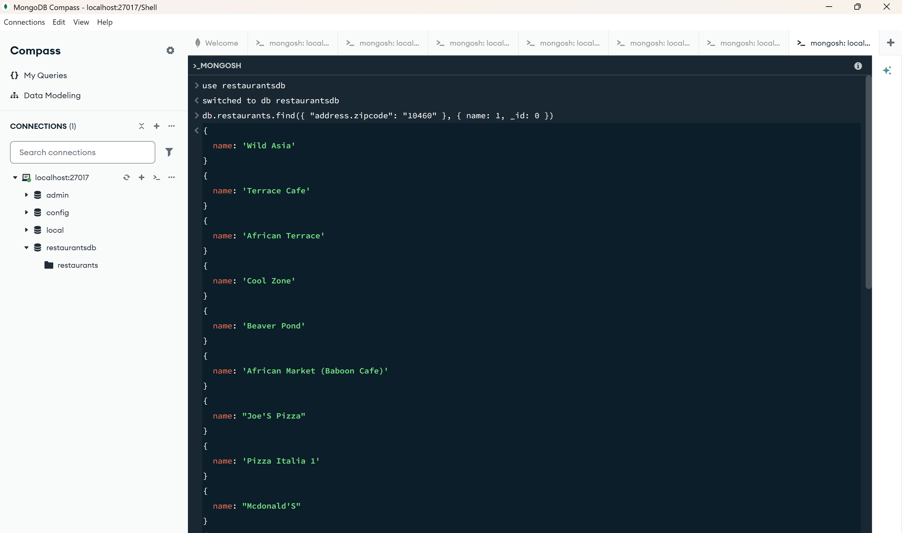

# Exercise 03: MongoDB – Document Queries and Analysis

- Name: Abdelhafidh Mahouel
- Course: Database for Analytics
- Module: 3
- Database Used: MongoDB
- Dataset: `restaurants-json.json`

---

## Instructions

- Import the provided `restaurants-json.json` file into MongoDB.
- All commands must be **executed by you** in the MongoDB shell or MongoDB Compass.
- For each query:
  - Include the MongoDB command in a fenced code block
  - Include a **screenshot** showing the command and its result
- Store screenshots in the `screenshots/` folder and embed them below each answer.

---


**Note:** My database is named `restaurantsdb` and the collection is named `restaurants` (instead of `44661`, as originally suggested in the assignment instructions). All queries below use these names.


## Question 1

When importing the documents from `restaurants-json.json`,
**how many documents were imported into your collection**?

### Answer

25358 documents were imported into the restaurants collection.

### Screenshot

Verified using a count query in the MongoDB shell.

```javascript
use restaurantsdb
db.restaurants.countDocuments()
```


---

## Question 2

Before writing queries on the data,
**what command** do you use to set the
**MongoDB shell to operate on the `restaurantsdb` database**?

### MongoDB Command

```javascript
use restaurantsdb
```

### Screenshot


---

## Question 3

Using your `restaurants` collection in the `restaurantsdb` database,
write the MongoDB query needed to
**locate all documents in the `"Queens"` borough**.

### MongoDB Query

```javascript
use restaurantsdb
db.restaurants.find({ borough: "Queens" })
```

### Screenshot



---

## Question 4

Using your `restaurants` collection in the `restaurantsdb` database,
write the MongoDB query needed to
**find the number of restaurants in the `"Queens"` borough**.

### MongoDB Query

```javascript
use restaurantsdb
db.restaurants.countDocuments({ borough: "Queens" })
```

### Screenshot


---

## Question 5

Using your `restaurants` collection in the `restaurantsdb` database,
write the MongoDB query needed to
**find the number of restaurants** in the `"Queens"` borough
**whose cuisine is `"Hamburgers"`**.

### MongoDB Query

```javascript
use restaurantsdb
db.restaurants.countDocuments({ borough: "Queens", cuisine: "Hamburgers" })
```

### Screenshot



---

## Question 6

Using your `restaurants` collection in the `restaurantsdb` database,
write the MongoDB query needed to
**find the number of restaurants in Zipcode `10460`**.

_Hint: Look up how to query **embedded documents**._

### MongoDB Query

```javascript
use restaurantsdb
db.restaurants.countDocuments({ "address.zipcode": "10460" })
```

### Screenshot


---

## Question 7

Using your `restaurants` collection in the `restaurantsdb` database,
write the MongoDB query needed to
**display only the names of restaurants in Zipcode `10460`**.

_Hint: Look up how to **project fields** in MongoDB._

Your output should resemble:

```json
{ name: "Wild Asia" }
{ name: "Terrace Cafe" }
{ name: "African Terrace" }
{ name: "Cool Zone" }
{ name: "Beaver Pond" }
...
```

### MongoDB Query

```javascript
use restaurantsdb
db.restaurants.find({ "address.zipcode": "10460" }, { name: 1, _id: 0 })
```

### Screenshot



---

## Question 8

Using your `restaurants` collection in the `restaurantsdb` database,
write the MongoDB query needed to
**display only the names of restaurants whose name contains `"IHOP"`**,
ignoring case.

Your results should include:

- `"Ihop"`
- `"Ihop Restaurant"`

### MongoDB Query

```javascript
use restaurantsdb
db.restaurants.find(
  { name: { $regex: "ihop", $options: "i" } },
  { name: 1, _id: 0 }
)
```

### Screenshot


