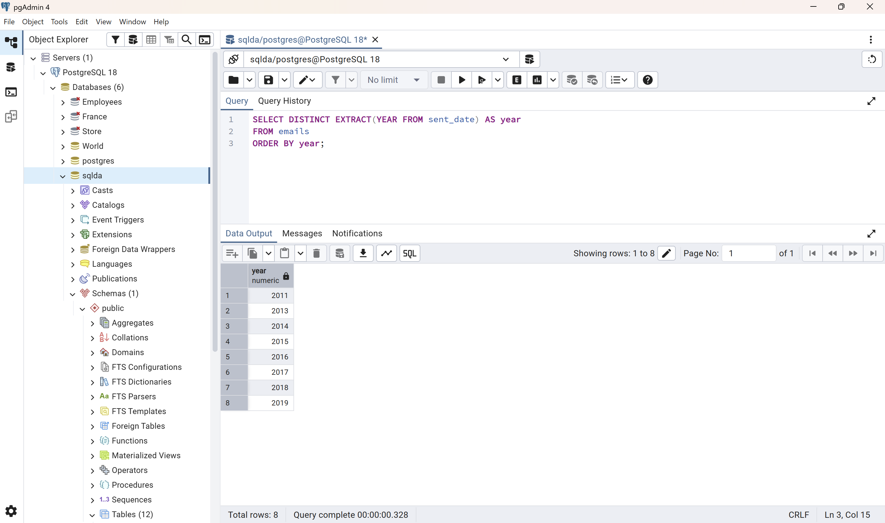
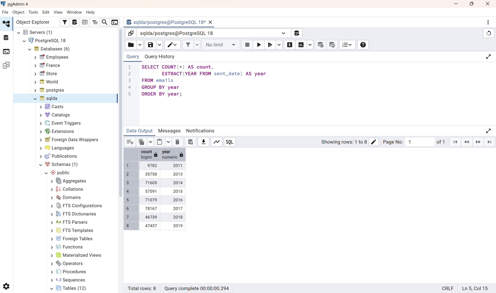
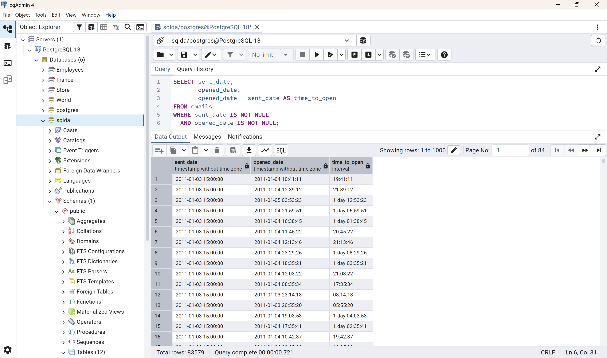
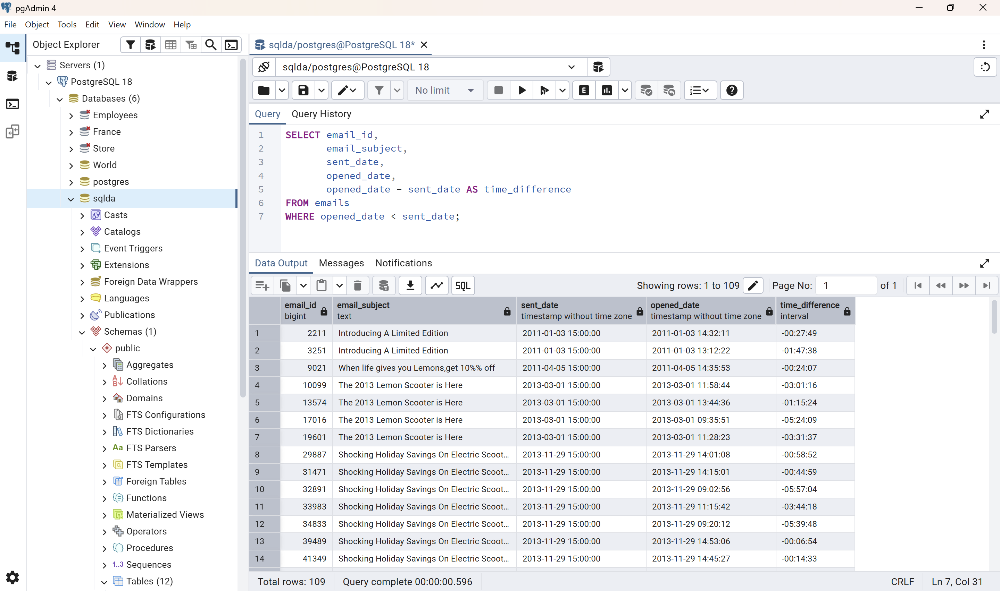
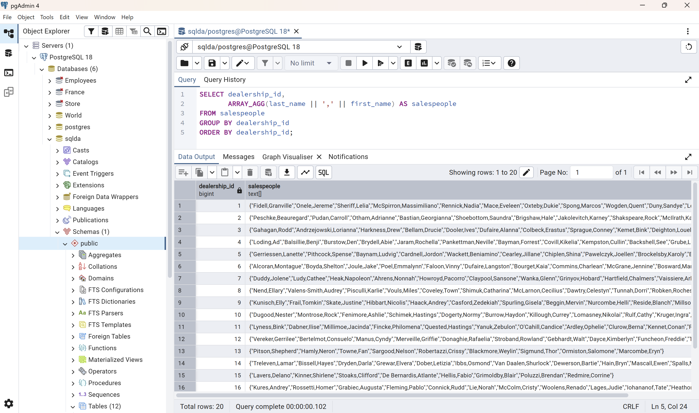
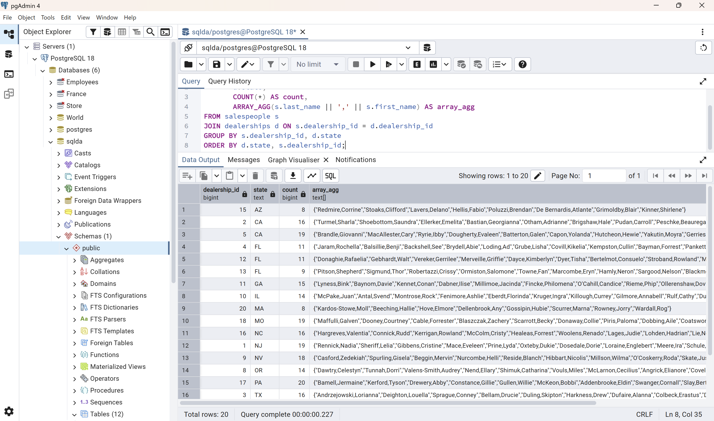
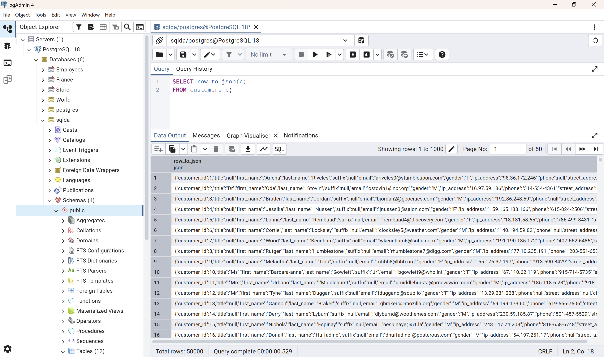
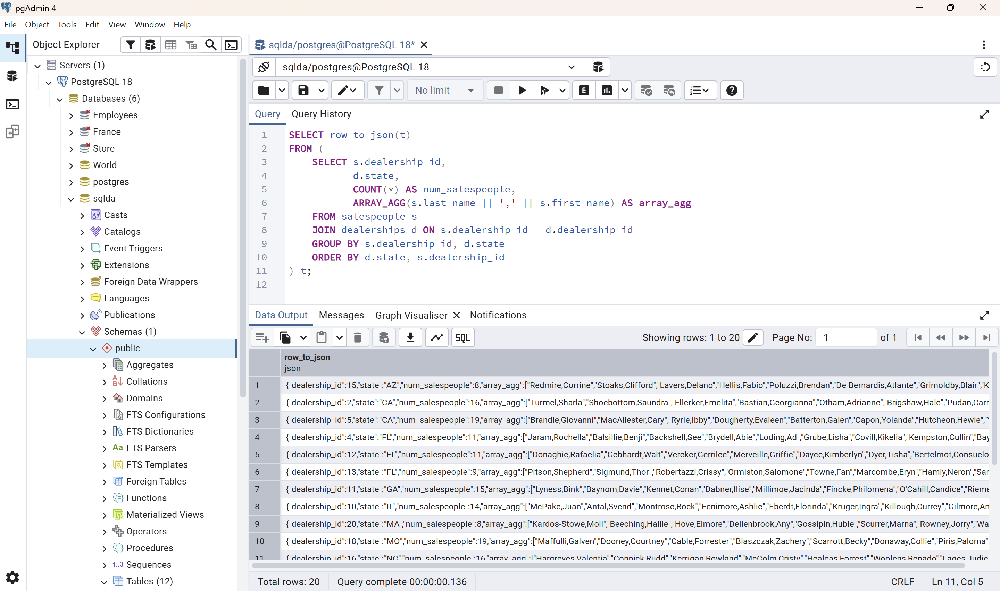

# Exercise 05: SQLDA Database - Dates, Data Quality, Arrays, and JSON

- Name: Abdelhafidh Mahouel
- Course: Database for Analytics
- Module: 05
- Database Used: `sqlda` (Sample Datasets)
- Tools Used: PostgreSQL (pgAdmin or psql)

---

## Instructions

- Use the **sqlda** database from the "Loading the Sample Datasets" instructions.
- For each SQL task:
  - Include your SQL in a fenced code block
  - Execute it and include a **screenshot** showing the query and results
- Store screenshots in the `screenshots/` folder and embed them below each answer.
- For explanation questions:
  - Write your answer in complete sentences
  - Include a screenshot if requested

---

## Question 1

Using the `sqlda` database, write the SQL needed
to show a **list of years** that emails were sent.

Your results should list years like this (order matters):

```text
year
2011
2013
2014
2015
2016
2017
2018
2019
```

### SQL

```sql
SELECT DISTINCT EXTRACT(YEAR FROM sent_date) AS year
FROM emails
ORDER BY year;
```

### Screenshot



---

## Question 2

Using the `sqlda` database, write the SQL needed to
show the **number of messages sent by year**,
ordered by year (as shown in the prompt).

Output should resemble:

```text
count   year
...
```

### SQL

```sql
SELECT COUNT(*) AS count,
       EXTRACT(YEAR FROM sent_date) AS year
FROM emails
GROUP BY year
ORDER BY year;
```

### Screenshot



---

## Question 3

Using the `sqlda` database, write the SQL needed to show:

- the **sent date**
- the **opened date**
- the **interval** between the two

Only include emails that contain **both** a sent date and an opened date.

### SQL

```sql
SELECT sent_date,
       opened_date,
       opened_date - sent_date AS time_to_open
FROM emails
WHERE sent_date IS NOT NULL
  AND opened_date IS NOT NULL;
```

### Screenshot



---

## Question 4

Using the `sqlda` database,
write the SQL needed to
show emails that contain an **opened date BEFORE the sent date**.

### SQL

```sql
SELECT email_id,
       email_subject,
       sent_date,
       opened_date,
       opened_date - sent_date AS time_difference
FROM emails
WHERE opened_date < sent_date;
```

### Screenshot



---

## Question 5

Using the `sqlda` database:
there are **over 100 emails**
that contain an opened date **BEFORE** the sent date.

After looking at the data, **why is this the case?**

### Answer

_After looking at the 109 results from Question 4, I noticed that every email has a sent time of exactly 15:00:00, and every opened date is on the same day, only a few minutes to about 11 hours earlier than the sent time. The emails were not actually opened before they were sent. This is most likely a time zone problem. Both columns use the `timestamp without time zone` data type, so the database does not store which time zone each value is in. The sent date appears to be recorded in one time zone (such as UTC), while the opened date is recorded in the customer's local time. Since US time zones are several hours behind UTC, an email opened shortly after it was sent can look like it was opened before it was sent. This shows why it is important to store and compare dates in the same time zone, for example by using `timestamp with time zone`._

### Screenshot (if requested by instructor)


---

## Question 6

Using the `sqlda` database, explain in your own words what the following code does:

```sql
CREATE TEMP TABLE customer_points AS (
    SELECT
        customer_id,
        point(longitude, latitude) AS lng_lat_point
    FROM customers
    WHERE longitude IS NOT NULL
    AND latitude IS NOT NULL
);

CREATE TEMP TABLE dealership_points AS (
    SELECT
        dealership_id,
        point(longitude, latitude) AS lng_lat_point
    FROM dealerships
);

CREATE TEMP TABLE customer_dealership_distance AS (
    SELECT
       customer_id,
       dealership_id,
       c.lng_lat_point <@> d.lng_lat_point AS distance
    FROM customer_points c
    CROSS JOIN dealership_points d
);
```

### Answer

_This code calculates the distance between every customer and every dealership. The first statement creates a temporary table called `customer_points` that converts each customer's longitude and latitude into a single `point` value, and it skips any customers that are missing either coordinate. The second statement does the same thing for every dealership and stores the results in a temporary table called `dealership_points`. The third statement uses a `CROSS JOIN` to pair every customer with every dealership, and then uses the `<@>` operator from the `earthdistance` extension to calculate the distance in miles between the two points. The final result is a temporary table called `customer_dealership_distance` with one row for each customer and dealership pair and the distance between them, which could be used to find the closest dealership to each customer. Longitude is listed first in `point()` because it represents the x-axis and latitude represents the y-axis. Because these are temporary tables, they are automatically deleted when the database session ends._

---

## Question 7

Using the `sqlda` database,
write SQL to display an
**array of salespeople for each dealership**,
sorted by dealership.

For example - dealership 1 is below:

```text
"{""Fidell,Granville"",""Onele,Jereme"",""Sheriff,Lelia"",""McSpirron,Massimiliano"",""Rennick,Nadia"",""Mace,Eveleen"",""Oxteby,Dukie"",""Spong,Marcos"",""Wogden,Quent"",""Duny,Sandye"",""Loraine,Englebert"",""Meere,Ira"",""Gibbens,Cristine"",""Prine,Lyda"",""McCoughan,Sheff"",""Schule,Giselbert"",""McAndie,Eleen"",""Dosedale,Dorie"",""Nafziger,Shay""}"
```

### SQL

```sql
SELECT dealership_id,
       ARRAY_AGG(last_name || ',' || first_name) AS salespeople
FROM salespeople
GROUP BY dealership_id
ORDER BY dealership_id;
```

### Screenshot



---

## Question 8

Using the `sqlda` database, write SQL to display:

- an **array of salespeople for each dealership**
- the **state** of the dealership
- the **number of salespeople** for the dealership

Sort by **state**.

Reference image:


### SQL

```sql
SELECT s.dealership_id,
       d.state,
       COUNT(*) AS count,
       ARRAY_AGG(s.last_name || ',' || s.first_name) AS array_agg
FROM salespeople s
JOIN dealerships d ON s.dealership_id = d.dealership_id
GROUP BY s.dealership_id, d.state
ORDER BY d.state, s.dealership_id;
```

### Screenshot



---

## Question 9

Using the `sqlda` database, write the SQL needed to convert
the **customers** table to **JSON**.

### SQL

```sql
SELECT row_to_json(c)
FROM customers c;
```

### Screenshot



---

## Question 10

Using the `sqlda` database, write SQL to display:

- an **array of salespeople for each dealership**
- the **state**
- the **number of salespeople**
- sorted by **state**

Then **convert this result to JSON**.

Reference image:


### SQL

```sql
SELECT row_to_json(t)
FROM (
    SELECT s.dealership_id,
           d.state,
           COUNT(*) AS num_salespeople,
           ARRAY_AGG(s.last_name || ',' || s.first_name) AS array_agg
    FROM salespeople s
    JOIN dealerships d ON s.dealership_id = d.dealership_id
    GROUP BY s.dealership_id, d.state
    ORDER BY d.state, s.dealership_id
) t;
```

### Screenshot


