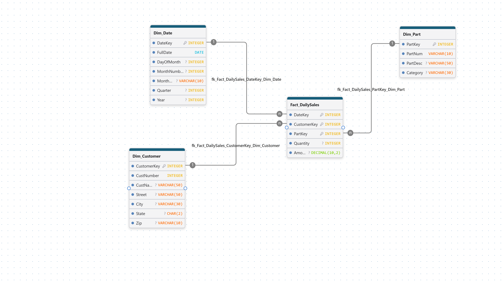

# Module 6 - Exercise 1: Creating a Data Warehouse

From the Operational Model to the Dimensional Model

- Name: Abdelhafidh Mahouel
- Course: Database for Analytics
- Module: 6

---

## Overview

In this exercise you will design a **dimensional (star schema) model**
for a data warehouse based on an **operational sales database**.

- **Business process:** Customer Sales
- **Grain:** Daily sales
- **Facts to store (only):**
  - **amount** = daily sales total amount (revenue)
  - **quantity** = daily sales total quantity (units sold)

You will determine the dimensions needed to support the required analytics.

---

## Operational Database Summary (Source System)

Tables in the operational model include:

- `customer` (custNumber, custName, address, currBal, credLimit, repNum)
- `parts` (partNum, partDesc, category, unitsOnHand, warehouseNum, unitPrice)
- `slsrep` (repNum, repName, repAddress, totComm, commRate)
- `orders` (orderNum, orderDate, custNum)
- `orderline` (orderNum, partNum, numOrdered)

---

## Analytics Requirements (What the Warehouse Must Support)

Your dimensional model must support questions such as:

- How many of part number **ax12** were sold on **September 2, 1994**?
- How many of part number **ax12** did customer **124** purchase last year?
- How much did customer **124** spend last year?
- What was the **average amount spent per customer per day** during September 1994?
- What was the **average quantity sold of part ax12 per day** during September 1994?
- What was the **average daily sales** during the third quarter of 1994?
- How many **appliance** items were sold during the third quarter of 1994?
- What was the amount of revenue generated by customers in
  **zip code 64468** during September 1994?

---

## Out of Scope

We do **not** care about:

- Questions about **specific orders** (order-level reporting)
- Questions about **sales reps**
- Questions about **credit limits, balances**, or other customer finance fields
- Inventory questions (warehouseNum, unitsOnHand, etc.)

---

## Key Design Constraints

- The warehouse must be a **star schema**.
- The fact table must store only:
  - `amount`
  - `quantity`
- Data must be **aggregated as necessary from the operational database before loading**.
- The grain is **daily sales** (not per order, not per orderline).

---

## Your Task

### Step 1: Design the Star Schema

Create a dimensional model that includes:

- One **fact table** (daily customer sales facts)
- Appropriate **dimension tables** (you decide which ones are necessary)

Your model must clearly show:

- Fact table name and fields
- Dimension table names and fields
- Primary keys and foreign keys
- Relationships (dimensions connect to the fact table)

---

## Deliverables

### 1) Star Schema Diagram (Required)

Create and submit a **diagram** of your star schema.

You may use any tool, such as:

- draw.io (diagrams.net)
- PowerPoint
- Google Drawings
- Lucidchart
- Hand-drawn on paper (then take a clear photo)

Save your diagram image in this repo and embed it below.

**File name suggestion:** `star-schema.png` or `star-schema.jpg`

#### Diagram

---

### 2) Design Notes (Required)

In 1-2 short paragraphs, explain:

- What dimensions you chose and why
- Why your fact table grain is daily sales
- How your design supports at least 3 of the required analytics questions

#### Design Notes

I used three dimensions: **Dim_Date**, **Dim_Customer**, and **Dim_Part**.
Every required question filters or groups by a day, month, quarter, or year, by a
customer (including zip code), or by a part (including category), so these three
are the only ones needed. I left out sales reps, orders, credit limits, balances,
and inventory fields because none of the questions use them. Each dimension has a
surrogate key, and the original operational keys (`custNumber`, `partNum`) are kept
as normal attributes. The operational `address` field holds street, city, and state
together, so I split it into `Street`, `City`, `State`, and `Zip` during the
transform step, which makes the zip code question possible.

The grain is **one row per customer, per part, per day**, because the requirement
is daily sales and we do not need order-level detail. During ETL, the `orderline`
rows are joined to `orders` (for the date and customer) and `parts` (for the unit
price), then grouped by date, customer, and part. `Quantity` is the sum of
`numOrdered`, and `Amount` is the sum of `numOrdered * unitPrice`. For example,
"How many ax12 were sold on September 2, 1994?" sums `Quantity` where `PartNum =
'ax12'` and `FullDate = '1994-09-02'`. "How much did customer 124 spend last
year?" sums `Amount` for `CustNumber = 124` filtered on `Year`. "How many appliance
items were sold in Q3 1994?" sums `Quantity` where `Category = 'appliance'`,
`Quarter = 3`, and `Year = 1994`.

The table definitions used to build the diagram are in
[exercise06_star_schema.sql](exercise06_star_schema.sql).
